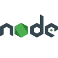
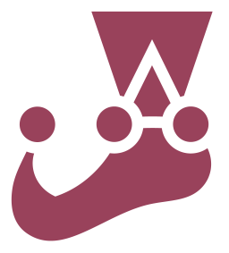

[][linkedin]

# Kon'nichiwa (Hello) !!, I'm Ayush Yadav 

<!--  -->

🎯 **Software Engineer | Performance Optimization | Full-Stack Developer**  
💻 C++ | Python | Java | System Verilog | AWS | GCP | CI/CD | DevOps  
📍 Based in India | 3+ years of experience at Cadence Design Systems

---

## 🔧 Technical Skills

- **Languages:** C++, Python, Java, JavaScript, TypeScript, C  
- **Frameworks/Libraries:** React, Node.js, Express, React Native, SASS, Jest  
- **Cloud & DevOps:** AWS, GCP, Docker, Kubernetes (basic), GitHub Actions, Jenkins, Terraform  
- **Databases:** MySQL, PostgreSQL, MongoDB  
- **Tools:** GDB, JIRA, Figma, Monitoring Tools, Perforce

 
 
 

---

## 💼 Professional Experience

### 🏢 **Cadence Design Systems** – *Software Engineer*  
📅 *July 2022 – Present*  
- Boosted Xcelium Simulator performance by **8–9%** via low-level optimizations (C++, Verilog).  
- Enabled **multi-million dollar deal** with Samsung through benchmark leadership.  
- Led RTL transformations for parsing speedups (3–4%) impacting clients like **Apple, Google, NVIDIA**.  
- Built and evangelized internal performance diagnostic tools, reducing RCA time by **40%**.  
- Delivered technical presentations at **Cadence India Conference (CIC)**.

---

## 🌱 Internships & Open Source

- **Script Winter of Code** – Built UniAuth (Google Sign-In clone) with TypeScript, Django, Go.  
- **Delta Winter of Code** – Dockerized log analyzer with Redis, Celery; integrated CI/CD.  
- **Tezos India Fellowship** – Built decentralized PvP [gaming app][gamegeeks] with NFT marketplace.  
- **Programming Club SoC** – Led 5-member team to build low-latency WebRTC video app.  
- **Trotbee (Backend Intern)** – Created OTP microservice on AWS; boosted video retrieval by 15%.  
- **Miri Infotech (SDE Intern)** – Built full-stack chat app (React, PostgreSQL, encryption, UX/UI).

---

## 🚀 Projects

- **Xcelium Xform Optimization Engine**  
  > Refactored inefficient RTL for parsing optimization; delivered 3–4% simulation gains.

- **Xcelium Performance Analysis Library**  
  > Built root-cause analysis tool for simulation bottlenecks; adopted internally and externally.

- **[Exercise Posture Correction System][proj_exercise_posture_detect]**  
  > Real-time posture detection using OpenCV & Mediapipe; achieved 95%+ accuracy.

---

## 🏆 Achievements

- 💰 Awarded **$10,000** for decentralized [gaming app][gamegeeks] on Tezos Blockchain  
- 🧠 5⭐ [HackerRank][hackerrank] Problem Solving  
- 🥇 Multiple podium finishes in college coding contests  
- 🥈 Gold & Silver medalist for academic excellence

---

## 💬 Volunteering & Leadership

- 👨‍🏫 Taught 100+ students via [YouTube][youtube] (Dev & CP)  
- ✍️ Published tech blogs on [Medium][medium]  
- 🚀 Co-founded **[Game Geeks][gamegeeks]** with $10,000 seed funding  
- 🧠 Contributor: Google Crowdsource (Level 8), [Stack Overflow][stackOverflow] (75+ rep)  
- 🎓 Led contests as Head of Programming – **Dynamix Club**

---

## 📫 Let's Connect

<!-- [][website] -->

[][youtube]
[][twitter]
[][linkedin]
[][medium]
[][instagram]
[][stackoverflow]
[][discord]
 

---

📕 **Latest Blog Posts**

<!-- BLOG-POST-LIST:START -->
- [Google I/O 2021 Punch Card Puzzle](https://binaryphoenix01.medium.com/google-i-o-2021-punch-card-puzzle-8b266724ec1d?source=rss-4009e2c77a------2)
- [Three Ways to Solve the Two Number Sum Problem](https://binaryphoenix01.medium.com/the-two-number-sum-problem-c4f36c7528f5?source=rss-4009e2c77a------2)
<!-- BLOG-POST-LIST:END -->

🎬 **Latest YouTube Videos**

<!-- YOUTUBE:START -->
- [How to Move Element to the End of an Array | Coding Interview Question](https://www.youtube.com/watch?v=DK2Gi0KlwgU)
- [Sort all the punch cards &lpar;Final Puzzle&rpar;| Google I/O 2021 Punchcard Puzzle 10](https://www.youtube.com/watch?v=P9Q8uiX5I7E)
- [Find the Quote | Google I/O 2021 Punchcard Puzzle 9](https://www.youtube.com/watch?v=2DidcRgfmg8)
- [Sort the Punch Cards | Google I/O 2021 Punchcard Puzzle 8](https://www.youtube.com/watch?v=clb-jua-ilA)
- [Find the Quote | Google I/O 2021 Punchcard Puzzle 7](https://www.youtube.com/watch?v=_MZkf4njacc)
<!-- YOUTUBE:END -->

 **Stack Overflow Activity**

<!-- STACKOVERFLOW:START -->
- [Answer by Binary Phoenix for How can i add icon to React Link?](https://stackoverflow.com/questions/67886495/how-can-i-add-icon-to-react-link/67887089#67887089)
- [Answer by Binary Phoenix for “list index out of range” with a loop](https://stackoverflow.com/questions/67640916/list-index-out-of-range-with-a-loop/67641111#67641111)
- [Answer by Binary Phoenix for How to turn this code into a one-liner or make it shorter?](https://stackoverflow.com/questions/67615524/how-to-turn-this-code-into-a-one-liner-or-make-it-shorter/67615656#67615656)
- [Answer by Binary Phoenix for Python execute While loop even if condition is not met?](https://stackoverflow.com/questions/67581156/python-execute-while-loop-even-if-condition-is-not-met/67581328#67581328)
- [Answer by Binary Phoenix for How to combine function with a list in python?](https://stackoverflow.com/questions/67571145/how-to-combine-function-with-a-list-in-python/67572352#67572352)
<!-- STACKOVERFLOW:END -->

<!--  **Recent Github Activity**
<!-- START_SECTION:activity  -->
<!-- END_SECTION:activity  -->

---

  
⚡ Most Used Languages

  
⚡ Github Streak

  
⚡ GitHub Stats

  <!--
⚡ GitHub Stats 

  

<!-- [website]: http://google.com -->

<!--START_SECTION:activity-->
1. 🎉 Merged PR [#1](https://github.com/blackphoenix42/Daily-Coding-Problem-Solutions/pull/1) in [blackphoenix42/Daily-Coding-Problem-Solutions](https://github.com/blackphoenix42/Daily-Coding-Problem-Solutions)
2. 💪 Opened PR [#1](https://github.com/blackphoenix42/Daily-Coding-Problem-Solutions/pull/1) in [blackphoenix42/Daily-Coding-Problem-Solutions](https://github.com/blackphoenix42/Daily-Coding-Problem-Solutions)
<!--END_SECTION:activity-->

[youtube]: https://www.youtube.com/channel/UCcINlOM-rC1_8yiRGH_iFBg?sub_confirmation=1
[instagram]: https://www.instagram.com/binary.phoenix/
[medium]: https://medium.com/@binaryphoenix01
[discord]: https://discord.gg/mRUZEhD
[twitter]: https://www.twitter.com/BinaryPhoenix/
[linkedin]: https://www.linkedin.com/in/ayushyadav/
[stackoverflow]: https://stackoverflow.com/users/13237616
[hackerrank]: https://www.hackerrank.com/profile/BinaryPhoenix
[gamegeeks]: https://github.com/Game-Geeks-Org
[proj_exercise_posture_detect]: https://github.com/blackphoenix42/exercise-posture-detection
