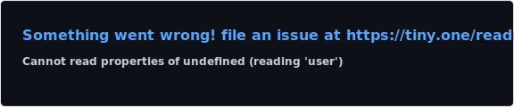

<div align="center">
  
</div>

<div align="center">


</div>

<div align="center">
  
  
  
  
</div>

<br>

<div align="center">
  <table>
    <tr>
      <td align="center" width="50%">
        
      </td>
      <td align="center" width="50%">
        
      </td>
    </tr>
  </table>
</div>

<div align="center">
  
</div>

<div align="center">
  
</div>

<br>

## 🧠 Software Engineering Arsenal

<div align="center">
  <table>
    <tr>
      <td align="center" width="20%">
        
        <br><strong>C++</strong>
        <br><sub>Primary Language</sub>
      </td>
      <td align="center" width="20%">
        
        <br><strong>Python</strong>
        <br><sub>Scripting & Tooling</sub>
      </td>
      <td align="center" width="20%">
        
        <br><strong>TypeScript</strong>
        <br><sub>Type-safe Services</sub>
      </td>
      <td align="center" width="20%">
        
        <br><strong>Java</strong>
        <br><sub>JVM & Concurrency</sub>
      </td>
      <td align="center" width="20%">
        
        <br><strong>Go</strong>
        <br><sub>Systems & Services</sub>
      </td>
    </tr>
     <tr>
      <td align="center" width="20%">
        
        <br><strong>Node.js</strong>
        <br><sub>Backend Runtime</sub>
      </td>
      <td align="center" width="20%">
        
        <br><strong>Express</strong>
        <br><sub>REST APIs</sub>
      </td>
      <td align="center" width="20%">
        
        <br><strong>GraphQL</strong>
        <br><sub>Contracts & Schemas</sub>
      </td>
      <td align="center" width="20%">
        
        <br><strong>Nginx</strong>
        <br><sub>Gateway & Routing</sub>
      </td>
      <td align="center" width="20%">
        
        <br><strong>Postman</strong>
        <br><sub>API Testing</sub>
      </td>
    </tr>
       <tr>
      <td align="center" width="20%">
        
        <br><strong>PostgreSQL</strong>
        <br><sub>Relational & Indexing</sub>
      </td>
      <td align="center" width="20%">
        
        <br><strong>Redis</strong>
        <br><sub>Caching & Rate Limits</sub>
      </td>
      <td align="center" width="20%">
        
        <br><strong>MongoDB</strong>
        <br><sub>Document Store</sub>
      </td>
      <td align="center" width="20%">
        
        <br><strong>Kafka</strong>
        <br><sub>Streaming & Backpressure</sub>
      </td>
      <td align="center" width="20%">
        
        <br><strong>RabbitMQ</strong>
        <br><sub>Queues & Delivery</sub>
      </td>
    </tr>
     <tr>
      <td align="center" width="20%">
        
        <br><strong>AWS</strong>
        <br><sub>Infra & Services</sub>
      </td>
      <td align="center" width="20%">
        
        <br><strong>GCP</strong>
        <br><sub>Cloud Tooling</sub>
      </td>
      <td align="center" width="20%">
        
        <br><strong>Docker</strong>
        <br><sub>Containers & Images</sub>
      </td>
      <td align="center" width="20%">
        
        <br><strong>Kubernetes</strong>
        <br><sub>Orchestration</sub>
      </td>
      <td align="center" width="20%">
        
        <br><strong>Terraform</strong>
        <br><sub>IaC & Environments</sub>
      </td>
    </tr>
    <tr>
      <td align="center" width="20%">
        
        <br><strong>Prometheus</strong>
        <br><sub>Metrics & Alerts</sub>
      </td>
      <td align="center" width="20%">
        
        <br><strong>Grafana</strong>
        <br><sub>Dashboards</sub>
      </td>
      <td align="center" width="20%">
        
        <br><strong>GitHub Actions</strong>
        <br><sub>CI/CD Pipelines</sub>
      </td>
      <td align="center" width="20%">
        
        <br><strong>Jenkins</strong>
        <br><sub>Build & Release</sub>
      </td>
      <td align="center" width="20%">
        
        <br><strong>Jest</strong>
        <br><sub>Unit & Integration</sub>
      </td>
    </tr>
     <tr>
      <td align="center" width="20%">
        
        <br><strong>Linux</strong>
        <br><sub>Runtime & Toolchains</sub>
      </td>
      <td align="center" width="20%">
        
        <br><strong>Bash</strong>
        <br><sub>Automation & Scripts</sub>
      </td>
      <td align="center" width="20%">
        
        <br><strong>CMake</strong>
        <br><sub>Build Systems</sub>
      </td>
      <td align="center" width="20%">
        
        <br><strong>Git</strong>
        <br><sub>Version Control</sub>
      </td>
      <td align="center" width="20%">
        
        <br><strong>VS Code</strong>
        <br><sub>DX & Debugging</sub>
      </td>
    </tr>
  </table>
</div>

<br>

## 🚀 Featured Projects

<div align="center">
  <table>
    <tr>
      <td align="center" width="33%">
        
        <br><br>
        <strong>Interactive algorithm visualizer with deterministic replay</strong>
        <br><br>
        
        
        
        
        
        <br><br>
        
      </td>
      <td align="center" width="33%">
        
        <br><br>
        <strong>Performance diagnosis library for large RTL simulations</strong>
        <br><br>
        
        
        
        
        
        <br><br>
        
      </td>
      <td align="center" width="33%">
        
        <br><br>
        <strong>Real-time posture correction using pose estimation</strong>
        <br><br>
        
        
        
        <br/>
        
        
        
        <br><br>
        
      </td>
    </tr>
  </table>
</div>

<br>

## 📊 Development Activity

<div align="center">
  
</div>

<br>

## 📡 Live Activity Feeds

<details>
  <summary>
    
    <span style="font-weight:600; margin:0 8px;">Latest Blog Posts</span>
  </summary>

  <!-- BLOG-POST-LIST:START -->
 1. ✍️ [Google I/O 2021 Punch Card Puzzle](https://binaryphoenix01.medium.com/google-i-o-2021-punch-card-puzzle-8b266724ec1d?source=rss-4009e2c77a------2) 

 2. 📝 [Three Ways to Solve the Two Number Sum Problem](https://binaryphoenix01.medium.com/the-two-number-sum-problem-c4f36c7528f5?source=rss-4009e2c77a------2) 
<!-- BLOG-POST-LIST:END -->

</details>

<details>
  <summary>
    
    <span style="font-weight:600; margin:0 8px;">Latest YouTube Videos</span>
  </summary>

  <!-- YOUTUBE:START --><table><tr><td><a href="https://www.youtube.com/watch?v=DK2Gi0KlwgU"></a></td>
<td><a href="https://www.youtube.com/watch?v=DK2Gi0KlwgU">How to Move Element to the End of an Array | Coding Interview Question</a><br/>May 28, 2021</td></tr></table>
<table><tr><td><a href="https://www.youtube.com/watch?v=P9Q8uiX5I7E"></a></td>
<td><a href="https://www.youtube.com/watch?v=P9Q8uiX5I7E">Sort all the punch cards &lpar;Final Puzzle&rpar;| Google I/O 2021 Punchcard Puzzle 10</a><br/>May 13, 2021</td></tr></table>
<table><tr><td><a href="https://www.youtube.com/watch?v=2DidcRgfmg8"></a></td>
<td><a href="https://www.youtube.com/watch?v=2DidcRgfmg8">Find the Quote | Google I/O 2021 Punchcard Puzzle 9</a><br/>May 13, 2021</td></tr></table>
<!-- YOUTUBE:END -->
  
</details>

<details>
  <summary>
    
    <span style="font-weight:600; margin:0 8px;">Recent Stack Overflow Answers</span>
  </summary>

  <!-- STACKOVERFLOW:START -->
 1. 🧠 [Answer by Binary Phoenix for How can i add icon to React Link?](https://stackoverflow.com/questions/67886495/how-can-i-add-icon-to-react-link/67887089#67887089) 

 2. ⚡ [Answer by Binary Phoenix for “list index out of range” with a loop](https://stackoverflow.com/questions/67640916/list-index-out-of-range-with-a-loop/67641111#67641111) 

 3. 🧩 [Answer by Binary Phoenix for How to turn this code into a one-liner or make it shorter?](https://stackoverflow.com/questions/67615524/how-to-turn-this-code-into-a-one-liner-or-make-it-shorter/67615656#67615656) 
<!-- STACKOVERFLOW:END -->

</details>

<details>
  <summary>
    
    <span style="font-weight:600; margin:0 8px;">Recent GitHub Activity</span>
  </summary>

  <!--START_SECTION:activity-->

1. ❌ Closed PR [#11](undefined) in [blackphoenix42/blackphoenix42](https://github.com/blackphoenix42/blackphoenix42)
2. ❌ Closed PR [#10](undefined) in [blackphoenix42/blackphoenix42](https://github.com/blackphoenix42/blackphoenix42)
<!--END_SECTION:activity-->

</details>

  <br/>

## ⏱️ Cumulative Coding Time

<!--START_SECTION:waka-->

```rust
Total Time: 146 hrs 18 mins

Other              93 hrs 41 mins  ⣿⣿⣿⣿⣿⣿⣿⣿⣿⣿⣿⣿⣿⣿⣿⣿⣀⣀⣀⣀⣀⣀⣀⣀⣀   64.03 %
TypeScript         22 hrs 23 mins  ⣿⣿⣿⣷⣀⣀⣀⣀⣀⣀⣀⣀⣀⣀⣀⣀⣀⣀⣀⣀⣀⣀⣀⣀⣀   15.31 %
Markdown           10 hrs 12 mins  ⣿⣶⣀⣀⣀⣀⣀⣀⣀⣀⣀⣀⣀⣀⣀⣀⣀⣀⣀⣀⣀⣀⣀⣀⣀   06.98 %
JSON               4 hrs 20 mins   ⣶⣀⣀⣀⣀⣀⣀⣀⣀⣀⣀⣀⣀⣀⣀⣀⣀⣀⣀⣀⣀⣀⣀⣀⣀   02.96 %
C++                4 hrs 16 mins   ⣶⣀⣀⣀⣀⣀⣀⣀⣀⣀⣀⣀⣀⣀⣀⣀⣀⣀⣀⣀⣀⣀⣀⣀⣀   02.92 %
YAML               4 hrs           ⣶⣀⣀⣀⣀⣀⣀⣀⣀⣀⣀⣀⣀⣀⣀⣀⣀⣀⣀⣀⣀⣀⣀⣀⣀   02.74 %
Python             2 hrs 32 mins   ⣦⣀⣀⣀⣀⣀⣀⣀⣀⣀⣀⣀⣀⣀⣀⣀⣀⣀⣀⣀⣀⣀⣀⣀⣀   01.74 %
JavaScript         1 hr 5 mins     ⣄⣀⣀⣀⣀⣀⣀⣀⣀⣀⣀⣀⣀⣀⣀⣀⣀⣀⣀⣀⣀⣀⣀⣀⣀   00.75 %
SVG                47 mins         ⣄⣀⣀⣀⣀⣀⣀⣀⣀⣀⣀⣀⣀⣀⣀⣀⣀⣀⣀⣀⣀⣀⣀⣀⣀   00.54 %
Text               39 mins         ⣄⣀⣀⣀⣀⣀⣀⣀⣀⣀⣀⣀⣀⣀⣀⣀⣀⣀⣀⣀⣀⣀⣀⣀⣀   00.45 %
```

<!--END_SECTION:waka-->
<br>

## 🐍 Contribution Snake

<div align="center">
  
</div>

<br>

## 🌐 Connect & Collaborate

<div align="center">
  <table>
    <tr>
      <td align="center" width="20%">
        <a href="https://www.youtube.com/channel/UCcINlOM-rC1_8yiRGH_iFBg?sub_confirmation=1">
          
        </a>
      </td>
      <td align="center" width="20%">
        <a href="https://www.twitter.com/BinaryPhoenix/">
          
        </a>
      </td>
      <td align="center" width="20%">
        <a href="assets/backups/www-linkedin-com-90fd9c20.md">
          
        </a>
      </td>
      <td align="center" width="20%">
        <a href="assets/backups/medium-com-1a82200d.md">
          
        </a>
      </td>
    </tr>
    <tr>
      <td align="center" width="20%">
        <a href="https://www.instagram.com/binary.phoenix/">
          
        </a>
      </td>
      <td align="center" width="20%">
        <a href="https://stackoverflow.com/users/13237616">
          
        </a>
      </td>
      <td align="center" width="20%">
        <a href="https://discord.gg/mRUZEhD">
          
        </a>
      </td>
      <td align="center" width="20%">
        <a href="mailto:riseofgoldenbird@gmail.com">
          
        </a> 
      </td>
    </tr>
  </table>
</div>

<br>

<!-- QUOTE:START -->
<div align="center">
  
</div>
<!-- QUOTE:END -->

<!-- FOOTER_START -->
<div align="center">
  
</div>
<!-- FOOTER_END -->

<div align="center">
  <sub>
    💡 <strong>Fun Fact:</strong> The motivational quote above and footer humor are automatically updated every 30 minutes to keep things fresh! 🔄
    <br>
  </sub>
</div>
